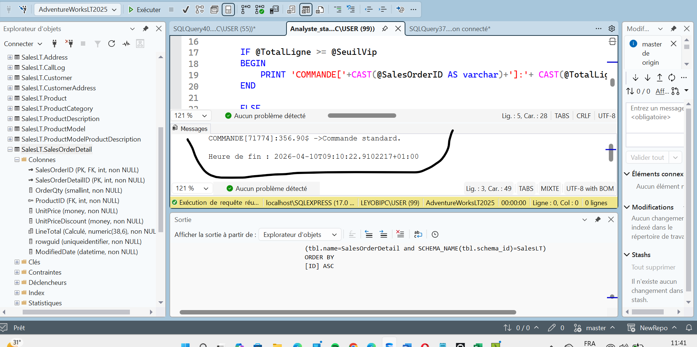
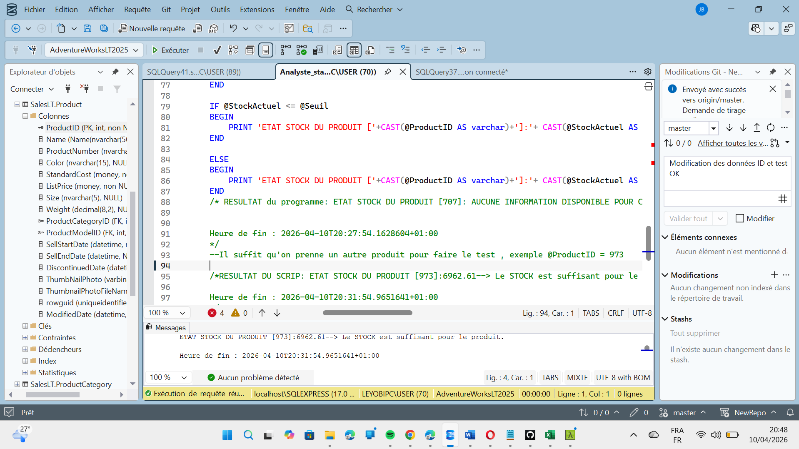
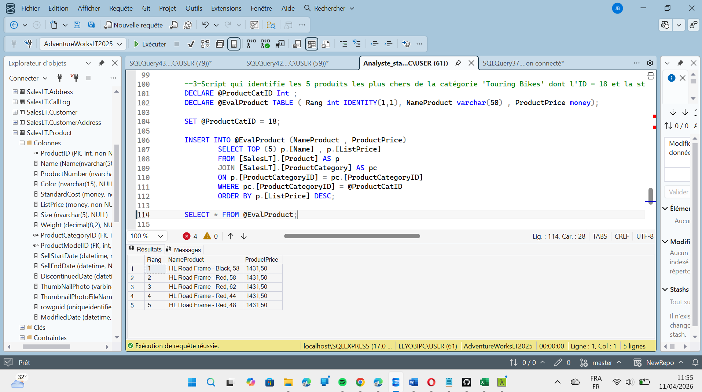

# NewRepo project data sql
L'utilisation du language de programmation T-SQL est très avantageuux car il permet dans une certaine mesure d'automatiser les taches du data Analyst et ainsi reduire le temps de réponse à une tache donnée . 
ceci n'est pas un projet à part entière mais juste un ensemble de taches souvent demandés en Entreprise . 
 
Cette partie se fait sur l'outil SQL SERVER 2025 accompagné de son interface SSMS22.  
 
La base de données est celle fournir par Microsoft 'AdventureWorksLT2025'. 
 
La suite de ce projet ne sera qu'un ensemble de tache souvent demandé par les entreprises et vous pourrez entrevoir les script sql et les résultats  
 
<h3><b>1. CAS PRATIQUE : Calculateur de remise de fidélité </b></h3> 
Dans le but de vérifier si une commande fait partir des VIP , l'entreprise AdventureWorks fait l'Analyse des achats de ses clients afin des les classes pour d'éventuelles remises . 

Pour ce premier cas on a créer un script SQL pour vérifier si les achats du client correspondant à l'ID achat 71774 est VIP ou non et le résulta peut se constater juste en dessous du code . 
Voici l'image du resultat affiché par SQL apres avoir exécuté le code 
  

    
  

   
  On s'est amusé à tester avec notre ID et le résultat est bien toutjours satisfaisant .  
  Ce model est une programmation via outil Tsql pour créer une macgine intélligente qui fournit pour une un nombre important de variable un résultat imédiat , ceci pour faciliter la prise de déscision de l'entreprise . 
   
 <b><h3>Cas Pratique : Automatisation de la Gestion des Stocks (T-SQL)</h3></b> 
​Dans ce module, j'ai développé un script de programmation procédurale en T-SQL permettant d'automatiser le contrôle des stocks pour l'entreprise AdventureWorks. 
​🎯 Objectif 
​L'objectif est de créer un système d'alerte intelligent qui identifie automatiquement si un produit nécessite un réapprovisionnement en fonction d'un seuil critique défini.
​🛠️ Notions techniques utilisées : 
​Variables dynamiques : Utilisation de DECLARE pour stocker des ID produits et des seuils de sécurité. 
​Logique conditionnelle (IF...ELSE) : Mise en place de structures de décision pour classifier l'état des stocks. 
​Gestion des données manquantes : Utilisation de IS NULL pour assurer la fiabilité du script face aux données incomplètes. 
​Conversion de types : Utilisation de CAST pour générer des messages de rapport personnalisés et lisibles. 
​📊 Résultat 
​Le script extrait en temps réel les informations de la base de données et affiche instantanément un diagnostic (Stock suffisant / Alerte réapprovisionnement), facilitant ainsi la prise de décision pour les gestionnaires d'entrepôt. 
L'image suite montre le code effectué sur SSMS

  

 
<h3><b>3- CAS PRATIQUE T-SQL : Maîtrise de la Portée et des Variables de Table</b></h3> 
​📝 Description  
​Ce projet contient des scripts SQL développés dans l'environnement AdventureWorksLT. L'objectif est de démontrer ma capacité à manipuler des structures de données temporaires en mémoire pour optimiser l'analyse de données. 
​L'exercice se concentre sur l'extraction des produits les plus performants (Top 3 par prix) au sein d'une catégorie spécifique en utilisant des variables de table.
​🛠️ Concepts Techniques Appliqués  
​Variable de Table (DECLARE @TABLE) : Utilisation d'une structure en mémoire pour isoler des sous-ensembles de données sans impacter les tables physiques de la base.
​Portée des Variables (Scope) : Gestion de la durée de vie des variables au sein des lots (BATCH) délimités par l'instruction GO.
​Colonnes Auto-incrémentées (IDENTITY) : Génération automatique d'un rang pour classer les résultats extraits.
​Jointures & Filtres : Utilisation de JOIN, TOP (N), et ORDER BY pour cibler précisément les informations stratégiques.
​💡 Pourquoi cette approche ? 
​En tant qu'analyste, l'utilisation de variables de table est une "best practice" pour : 
​La Performance : Réduction des lectures/écritures sur disque par rapport aux tables temporaires physiques. 
​La Propreté du Code : Nettoyage automatique de la mémoire à la fin du lot. 
​L'Agilité : Permet de préparer des données transformées avant de les injecter dans un outil de visualisation comme Power BI ou Excel.
​📂 Aperçu du Code et RESULTAT  
  

    
  

